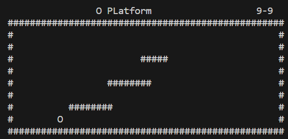

## O Platform Game

### ASCII platformer

Moves "O" hero on the screen

## Need to do:
* Create matrix of the lavel
* Generate the level
* "O" Leave level left check
* Title
* Music or beep sound
### Controls
* ESC to Exit
* Arrows to Move

